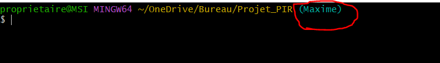

# Aide

### Prérequis

git : https://git-scm.com/downloads

## Initialiser le projet

- Commencez par récuperer le projet en ouvrant le git bash :
```
git clone https://github.com/mdescham22/Projet_PIR
```
Ce dossier est une copie du dossier de la branch master.

C'est un dossier de travail local! **il est à conserver sur votre pc**.

- Placez-vous dans le dossier projet puis créez un nouveau fichier git Bash


- Vérifiez que votre branch est bien disponible :
```
git branch -a
```
- PLacez-vous sur votre branch :
```
git checkout "tonPrénomAvecUneMajuscule"
```
Ca nous permet de travailler chacun de son côté

- Vérifier que vous êtes bien sur la branche :



Vous êtes pret à commencer :blush:

## Rendre le travail
- Dans l'ordre : 
```
git add .
git commit -m "ce que vous avez ajouté en plus"
git push -u origin "tonPrénomAvecUneMajuscule"
```

## Reprendre votre travail
Ouvrez un git bash dans le dossier de travail puis taper la commande
```
git pull
```
Elle va ajouter mettre à jour votre dossier local avec le projet sur github.
